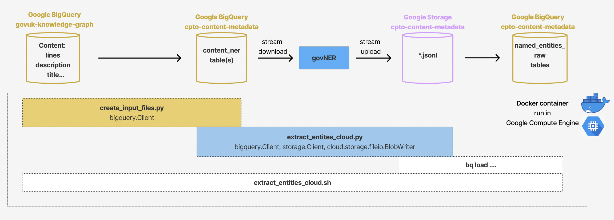

# `govuk-content-metadata`

Project work related to extracting metdadata from gov.uk content.

```{warning}
Where this documentation refers to the root folder we mean where this README.md is
located.
```

## Getting started

To start using this project, [first make sure your system meets its
requirements](#requirements).

To be added.

### Requirements

```{note} Requirements for contributors
[Contributors have some additional requirements][contributing]!
```

- Python 3.9+ installed
- a `.secrets` file with the [required secrets and
  credentials](#required-secrets-and-credentials)
- [load environment variables][docs-loading-environment-variables] from `.envrc`

To install the Python requirements and pre-commit hooks, open your terminal and enter:

```shell
make requirements
```

or, alternatively, to only install the necessary Python packages using pip:

```shell
pip install -r requirements.txt
```

## Required secrets and credentials

To run this project, [you need a `.secrets` file with secrets/credentials as
environmental variables][docs-loading-environment-variables-secrets]. The
secrets/credentials should have the following environment variable name(s):

| Secret/credential | Environment variable name | Description                                |
|-------------------|---------------------------|--------------------------------------------|
| Prodigy License   | `PRODIGY_LICENSE`         | Digit code                                 |

Once you've added, [load these environment variables using
`.envrc`][docs-loading-environment-variables].

## Licence

Unless stated otherwise, the codebase is released under the MIT License. This covers
both the codebase and any sample code in the documentation. The documentation is ©
Crown copyright and available under the terms of the Open Government 3.0 licence.

## Contributing

[If you want to help us build, and improve `govuk-content-metadata`, view our
contributing guidelines][contributing].

## Acknowledgements

[This project structure is based on the `govcookiecutter` template
project][govcookiecutter].

[contributing]: CONTRIBUTING.md
[govcookiecutter]: https://github.com/best-practice-and-impact/govcookiecutter
[docs-loading-environment-variables]: ./docs/user_guide/loading_environment_variables.md
[docs-loading-environment-variables-secrets]: ./docs/user_guide/loading_environment_variables.md#storing-secrets-and-credentials


<!-- SPACY PROJECT: AUTO-GENERATED DOCS START (do not remove) -->

# 🪐 spaCy Project: Content Metadata NER

A project for building a language model for HM Government

## 📋 project.yml

The [`project.yml`](project.yml) defines the data assets required by the
project, as well as the available commands and workflows. For details, see the
[spaCy projects documentation](https://spacy.io/usage/projects).

### ⏯ Commands

The following commands are defined by the project. They
can be executed using [`spacy project run [name]`](https://spacy.io/api/cli#project-run).
Commands are only re-run if their inputs have changed.

| Command | Description |
| --- | --- |
| `download` | Download a spaCy model with pretrained vectors |
| `db-in` | Load labelled .jsonl file data into prodigy |
| `train_prodigy` | Train a named entity recognition model with Prodigy |
| `train_curve` | Train the model with Prodigy by using different portions of training examples to evaluate if more annotations can potentially improve the performance |

### ⏭ Workflows

The following workflows are defined by the project. They
can be executed using [`spacy project run [name]`](https://spacy.io/api/cli#project-run)
and will run the specified commands in order. Commands are only re-run if their
inputs have changed.

| Workflow | Steps |
| --- | --- |
| `all` | `db-in` &rarr; `train_prodigy` &rarr; `train_curve` |

### 🗂 Assets

The following assets are defined by the project. They can
be fetched by running [`spacy project assets`](https://spacy.io/api/cli#project-assets)
in the project directory.

| File | Source | Description |
| --- | --- | --- |
| `data/gold/mark_goppepdm.jsonl` | Local | JSONL-formatted training data exported from Prodigy (2970 examples) |

<!-- SPACY PROJECT: AUTO-GENERATED DOCS END (do not remove) -->


# Inference pipeline [run in the cloud]

The pipeline is currently deployed in a Docker container onto a Virtual Machine (VM) instance on Google Compute Engine (GCE).

The GCE VM instance is called `bulk-inference-pipeline` in the `cpto-content-metadata` Google Project. **To run the pipeline, simply start the VM instance.**

If you want to know more about how to deploy pipelines in a Docker container onto a Google Compute Engine VM, refer to the Google official documentation [Deploying containers on VMs](https://cloud.google.com/compute/docs/containers/deploying-containers).

## Pipeline Flow and Components



## Code and configuration files

All the code and configuration files are in the [bulk_inference_pipeline](bulk_inference_pipeline) subdirectory in this repository.

In particular:
- [bulk_inference_config.yml](bulk_inference_pipeline/bulk_inference_config.yml) contains the specification of the Google Cloud Projects and BigQuery datasets used by the pipeline;
- [entities_bq_schema](bulk_inference_pipeline/entities_bq_schema) contains the BigQuery table schema that is used to export the extracted entities (and their metadata) from the JSONL files in Google Storage to Big Query tables;
- [bulk_inference_pipeline/cloudbuild.yaml](bulk_inference_pipeline/cloudbuild.yaml) contains the steps to build and submit the Docker image for the bulk inference pipeline to Artifect registry.

## VM specs

- Container-Optimized OS (COS)
- Boot Disk 100GB
- Architectire x86/64
- Machine Type: e2-standard-8

## Other System Requirements

- Google Project `cpto-content-metadata`
- Artefact Registry repository `europe-west2-docker.pkg.dev/cpto-content-metadata/cpto-content-metadata-docker-repo`
- Google Storage bucket `gs://cpto-content-metadata` and folder `gs://cpto-content-metadata/content_ner`
- Google BigQuery datasets `cpto-content-metadata.content_ner` and `cpto-content-metadata.named_entities_raw`

If you are contributing to / editing the pipeline:
- Docker

The pipeline is currently bundled into the following Docker image, hosted on Artifact Registry: `europe-west2-docker.pkg.dev/cpto-content-metadata/cpto-content-metadata-docker-repo/entity-inference-bulk:latest`

The pipeline relies on the availability of a spacy NER model which is downloaded when the pipeline's Docker image is built. At the moment, the latest model, which the pipeline is using, is:
- `gs://cpto-content-metadata/models/mdl_ner_trf_b1_b4`

Please update the Dockerfile and rebuild the image if the model changes.

## Required Permissions

To run the pipeline on GCP, the inference uses the `cpto-content-metadata-sa` service account associated to the `cpto-content-metadata` Google Project. The following permissions must be enabled:

- Storage Object Creator (roles/storage.objects.create) - required to enable writing of pipeline outputs to Google Storage
- BigQuery Data Editor (roles/bigquery.tables.create) - required to read / create / write to output tables
- Compute Admin (roles/compute.admin) - required to create / edit / delete Compute Engine VMs and Compute Disks

And, in addition:

- Artifact Registry Reader (roles/artifactregistry.reader) for the `europe-west2-docker.pkg.dev/cpto-content-metadata/cpto-content-metadata-docker-repo` Artefact Registry repository.
- BigQuery Data Reader (roles/bigquery.dataViewer) for the `govuk-knolwedge-graph.content dataset` dataset in BigQuery

## Editing and re-deplying the pipeline to GCE

After you have done with your editing to the pipeline, you need to re-build the container image and publish it to the Artefact repository so that this will be pulled from the repository and launched when the VM is started.

Ensure you are in the sub-directory that contains the `Dockerfile`:
```shell
cd bulk_inference_pipeline
```

Re-build and re-publish the container image:
```shell
gcloud builds submit --config cloudbuild.yaml
```

# Inference pipeline [run on a local machine]

## Required Permissions

In order to run the pipeline's computations on a local machine (rather than a GCE VM), it is necessary to have a Google account with the following permissions enabled:

- Storage Object Creator (roles/storage.objects.create) - required to enable writing of pipeline outputs to Google Storage for the `cpto-content-metadata` project;
- BigQuery Data Editor (roles/bigquery.tables.create) - required to read / create / write to output tables for the `cpto-content-metadata` project;
- BigQuery Data Reader (roles/bigquery.dataViewer) for the `govuk-knolwedge-graph.content dataset` dataset in BigQuery.

## Google Cloud authentication

The Google Cloud SDK is required to enable authentication with GCP on a local machine. Installation instructions for Mac (Brew) can be found [here](https://formulae.brew.sh/cask/google-cloud-sdk).

The following command can be used to authenticate with GCP:

```shell
gcloud auth login
```

Then ensure your Project is set to `cpto-content-metedata`.

## Other Requirements

- Download the spacy NER model from `gs://cpto-content-metadata/models/mdl_ner_trf_b1_b4/model-best` to the `models/` local folder. Note, you may need to create the local folder first.

    ```shell
    cd bulk_inference_pipeline
    mkdir models/
    gsutil -m cp -r gs://cpto-content-metadata/models/mdl_ner_trf_b1_b4/model-best models/
    ```

## Run the pipeline

1. Create the input files

    Go to the `bulk_inference_pipeline` and create the required input files in BigQuery:
    ```shell
    cd bulk_inference_pipeline
    python -m src.create_input_files
    ```

2. Extract the entities for a part of page (title, description, text).
You will need to re-run the computationally and memory expensive pipeline for each part of page separately, by re-running the bash script with the appropriate `-p` argument.

From the project root directory run:

```shell
cd bulk_inference_pipeline
bash local_run/extract_entities_local.sh \
    -p "title" \
    -m "models/model-best"
```

this will extract entities from all the `"titles"` of yesterday's GOV.UK pages using a pre-trained model saved in `models/model-best`, upload the .jsonl files to Google Storage and then transfer the data to BigQuery.

Follow the instructions in [extract_entities_local.sh](bulk_inference_pipeline/local_run/extract_entities_local.sh) to know how to specify optional arguments.
