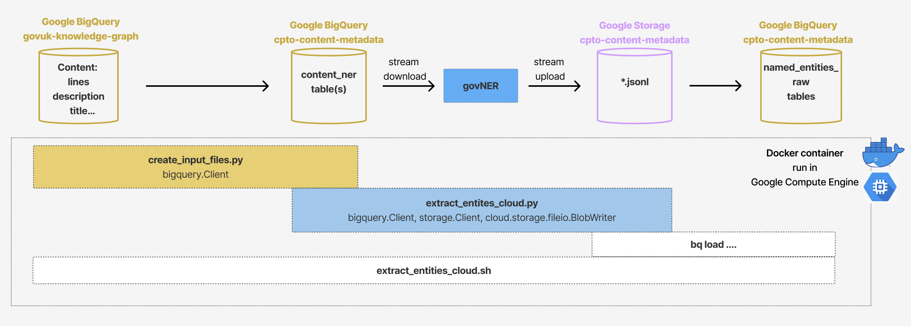

## Bulk Inference pipeline [run on a VM with GPU on Google Compute Engine]

The bulk inference pipeline extracts named entities from the whole GOV.UK content estate.

**Important Note**: Originally, this pipeline was automatically scheduled to run every two weeks. This scheduled execution has now been disactivated and replaced by the daily daily "new-content-only" NER inference pipeline. **The bulk inference pipeline is now to be set up and executed as a one-off, if either of the phase-1 entity or phase-2 entity models is retrained and re-deployed**.


### Setting up Phase-1 and Phase-2 Entity Inferences

Two Google Cloud Engine (GCE) Virtual Machines (VMs) must be created, with each instance executing one of the phase-1 or phase-2 entity inference pipeline. This is because two models were trained at separate times for the phase-1 and the phase-2 entities and (unlike for the daily inference pipeline), we ended up executing bulk inference for the two models separately, sequentially. This is likely to be reconsidered in the future.

Each pipeline gets deployed in a Docker container onto a Virtual Machine (VM) instance on Google Compute Engine (GCE) within the `cpto-content-metadata` Google Project.

#### Time of execution

The execution of the two pipelines (phase-1 and phase-2) must be scheduled carefully, to ensure the first pipeline terminates before the second one starts (we encountered GPU allocation issues if the two were run synchronously). Thus, **when/if re-deploying, please respect the following start and end times for each components**.


The order of execution between phase-1 and phase-2 can be swapped but please respect the times given in the diagram for a successful execution.

To set up or modify the post-processing Cloud Workflow, refer to the section [](#post-extraction-processing-and-aggregation)

**Important**: both phase-1 and phase-2 pipelines must be run even if only one of the two models has been re-trained and re-deployed. This is to ensure consistent and up-to-date extracted entities from the whole of GOV.UK content for both entity groups. Please pause the execution of the daily NER new-content-only inference pipeline when this is done.

To run the pipeline on an ad-hoc basis outside of this schedule, simply start the VM instance (please remember to turn it off!).


### Setting up the GCE VMs

Please refer to [bulk_inference_pipeline/config_vm/README.md](/bulk_inference_pipeline/config_vm/README.md) for instructions.


### Individual Pipeline Flow and Components




### Code and configuration files

All the code and configuration files are in the [bulk_inference_pipeline](bulk_inference_pipeline) subdirectory in this repository.

In particular:
- [bulk_inference_config.yml](bulk_inference_pipeline/bulk_inference_config.yml) contains the specification of the Google Cloud Projects and BigQuery datasets used by the pipeline;
- [entities_bq_schema](bulk_inference_pipeline/entities_bq_schema) contains the BigQuery table schema that is used to export the extracted entities (and their metadata) from the JSONL files in Google Storage to Big Query tables;
- [bulk_inference_pipeline/cloudbuild_phase*.yaml](bulk_inference_pipeline/cloudbuild_phase1.yaml) contains the steps to build and submit the Docker image for the bulk inference pipeline to Artifact Registry. There is one such file for each entity phase.


### GCE VM specs

Full info can be found in the [bulk_inference_pipeline/config_vm/README.md](/bulk_inference_pipeline/config_vm/README.md) file, and associated bash scripts in [bulk_inference_pipeline/config_vm](bulk_inference_pipeline/config_vm).

Based on experience, we recommend:

- machine-type: n1-standard-16
- image-family: ubuntu-2004-lts
- GPU: nvidia-tesla-t4
- boot-disk-size: 100GB


### Other System Requirements

- Artefact Registry repository `europe-west2-docker.pkg.dev/cpto-content-metadata/cpto-content-metadata-docker-repo`
- Google Storage bucket `gs://cpto-content-metadata` and folder `gs://cpto-content-metadata/content_ner`
- Google BigQuery datasets `cpto-content-metadata.content_ner` and `cpto-content-metadata.named_entities_raw`

If you are contributing to / editing the pipeline:
- Docker


### Required Permissions

To run the pipeline on GCP, the inference uses a custom GCP service account associated to the `cpto-content-metadata` Google Project. The following permissions must be enabled:

- roles/artifactregistry.reader
- roles/bigquery.admin
- roles/compute.admin
- roles/compute.instanceAdmin.v1
- roles/logging.logWriter
- roles/storage.objectCreator
- roles/storage.objectViewer
- roles/workflows.editor
- roles/workflows.invoker
- roles/storage.buckets.get (for the `gs://cpto-content-metadata` bucket)
- roles/artifactregistry.reader (for the `europe-west2-docker.pkg.dev/cpto-content-metadata/cpto-content-metadata-docker-repo` Artefact Registry repository)

And, in addition:

- BigQuery Data Reader (roles/bigquery.dataViewer) for the `govuk-knolwedge-graph.content` and ``govuk-knolwedge-graph.graph` dataset` dataset in BigQuery


### Secrets

The application depends on a secret value having been set as environment variables.

<details>
 <summary>Secrets</summary>

  |Secret                  |Description                                                                 |
  |------------------------|----------------------------------------------------------------------------|
  |NER_BULK_INFERENCE_SA   |GCP custom service account (full email) for the NER bulk inference pipeline |

 </details>


### Editing and re-deploying the pipeline to GCE

#### New or re-trained model

The pipeline relies on the availability of a custom spacy NER model, hosted on a Google Storage bucket, which is downloaded when the pipeline's Docker image is built.
For each Entity Phase {N}, the model is defined in the `bulk_inference_pipeline/cloudbuild_phase{N}.yaml` file. For instance, for Phase-1 entities, this is the [bulk_inference_pipeline/cloudbuild_phase1.yaml](bulk_inference_pipeline/cloudbuild_phase1.yaml) file.

Please update the relevant `cloudbuild_phase{N}.yaml` and rebuild the image if the model (or anything in the pipeline code) changes (see below)

#### Any other edits

After any editing to code, you need to re-build the container image and publish it to Artifact Registry so that this will be pulled from the repository and launched when the VM is started.

Ensure you are in the sub-directory that contains the `Dockerfile`:
```shell
cd bulk_inference_pipeline
```

Re-build and re-publish the container image:
```shell
gcloud builds submit --config cloudbuild_phase{N}.yaml .
```
where `{N}` is the Entity Phase number, e.g. 1.


### Creating the pipeline for a new Entity phase

If you need to build the pipeline for a new Entity Phase:

- simply create a new `bulk_inference_pipeline/cloudbuild_phase{N}.yaml`, seeting `{N}` appropriately, and update the relevant values with that phase's information (i.e., model filepath, Docker image name, phase number);

- then set up a new VM in GCE, following the instructions in [config_vm/README.md](/bulk_inference_pipeline/config_vm/README.md).


## Inference pipeline [run on a local machine]

We do not recommend to run the pipeline locally, unless you have a GPU available.

### Required Permissions (local)

In order to run the pipeline's computations on a local machine (rather than a GCE VM), it is necessary to have a Google account with the permissions enabled as for [#required-permissions](#required-permissions):

### Google Cloud authentication

The Google Cloud SDK is required to enable authentication with GCP on a local machine. Installation instructions for Mac (Brew) can be found [here](https://formulae.brew.sh/cask/google-cloud-sdk).

The following command can be used to authenticate with GCP:

```shell
gcloud auth login
```
then ensure your Project is set to the correct GCP project.


## Run the pipeline

```shell
docker run -v "$HOME/.config/gcloud:/gcp/config:ro" \
    -v /gcp/config/logs \
    --env GCLOUD_PROJECT=cpto-content-metadata \
    --env CLOUDSDK_CONFIG=/gcp/config \
    --env GOOGLE_APPLICATION_CREDENTIALS=/gcp/config/application_default_credentials.json \
    europe-west2-docker.pkg.dev/cpto-content-metadata/cpto-content-metadata-docker-repo/<DOCKER_IMAGE_NAME>
```

where <DOCKER_IMAGE_NAME> is the name of the pipeline's docker image.


## Post-extraction processing and aggregation

After the named entities are extracted by the models and uploaded to tables in the BigQuery `cpto-content-metadata.named_entities.named_entities_raw` dataset, the output undergoes further processing and aggregation.

This post-extraction process is executed by a google Cloud Workflow which should be scheduled to run after the bulk inference pipeline is expected to be finished.

All information about the post-extraction Workflow and how to set it up can be found in the [src/post_extraction_process](/src/post_extraction_process/) sub-directory.

The Workflow produces two BigQuey tables:

1. `cpto-content-metadata.named_entities.named_entities_all`:  one line per individual entity instance with as much noise as possible removed;

2. `cpto-content-metadata.named_entities.named_entities_counts`: aggregated table of counts of entity-type per url;

Table (2.) is then exported to a CSV.GZ file to a Google Storage bucket [gs://cpto-content-metadata/named_entities_counts/named_entities_counts.csv.gz](gs://cpto-content-metadata/named_entities_counts/named_entities_counts.csv.gz) that it is ready for govGraph ingestion.
