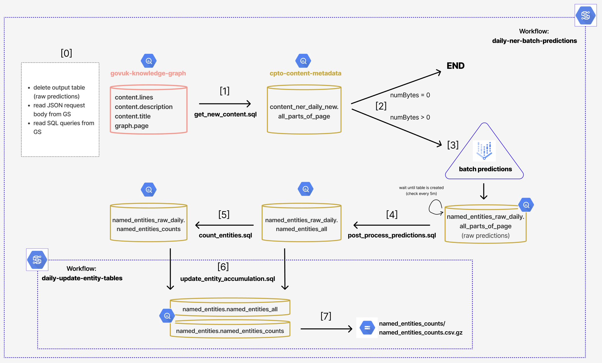

# Daily NER inference pipeline

A daily pipeline is scheduled to run at 3:00AM (UTC time) to extract named entities from the content items that substantially changed or were newly created the day before.

## Techstack and GCP roles

The pipeline uses the following tools:

- [Vertex AI Batch Predictions](https://cloud.google.com/vertex-ai/docs/predictions/get-predictions#get_batch_predictions) for a custom-trained model in a custom constainer
- Big Query
- Google Storage
- [GCP Cloud Workflow](https://cloud.google.com/workflows/docs/overview)
- An HTTP server that serve predictions for our fine-tuned NER model - refer to [fast_api_model_serving/README.md](../fast_api_model_serving/README.md) for how this was set up
- GitHub Actions for continous deployment.

The pipeline is managed through a custom GCP service account with the following roles/permissions:

- `roles/aiplatform.admin`
- `roles/bigquery.admin`
- `roles/iam.serviceAccountUser`
- `roles/logging.logWriter`
- `roles/storage.objectAdmin`
- `roles/workflows.editor`
- `roles/workflows.invoker`

The custom service account has been further set up as "iam.workloadIdentityUser" via Workload Identity Federation to authenticate and authorise GitHub Actions Workflows to Google Cloud. See [the section Workload Identity Federation below](#workload-identity-federation) for more info.

In addition, the custom service account has `bigquery.dataViewer` role for the following cross-project Big Query tables:
- govuk-knowledge-graph.graph.page
- govuk-knowledge-graph.content.lines
- govuk-knowledge-graph.content.description
- govuk-knowledge-graph.content.title

### Workload Identity Federation

We set up the process of authenticating and authorising GitHub Actions Workflows to Google Cloud via Workload Identity Federation, by following these instructions:
- https://github.com/google-github-actions/auth#setting-up-workload-identity-federation
- https://cloud.google.com/iam/docs/workload-identity-federation-with-deployment-pipelines

## GitHub Secrets

- `GCP_NER_NEW_CONTENT_PIPE_SA`: GCP custom service account for the daily NER pipeline (full email address);
- `GCP_GITHUB_WORKLOAD_IDENTITY_PROVIDER`: (Github) Workload Identity Provider source ID, in the format `projects/${GCP-PROJECT-NUMBER}/locations/global/workloadIdentityPools/${GCP-PROJECT-NAME}/providers/${WIP-PROVIDER-NAME}`.

## Continuous Deployment

The following Github Action workflows are in use by the pipeline:

- [deploy-batch-predictions-workflow.yaml](../.github/workflows/deploy-batch-predictions-workflow.yaml):
    deployes the Cloud Workflow specified in [`inference_pipeline_new_content/daily_batchjob_workflow.yml`](daily_batchjob_workflow.yml) to Google Cloud whenever changes to the YAML file are pushed to the remote.

- [deploy-daily-update-entity-tables-workflow.yaml](../.github/workflows/deploy-daily-update-entity-tables-workflow.yaml):
    deployes the Cloud Workflow specified in [`inference_pipeline_new_content/update_entity_buildup.yml`](update_entity_buildup.yml) to Google Cloud whenever changes to the YAML file are pushed to the remote.

- [upload-json-request-file-to-gs-batch-predictions.yaml](../.github/workflows/upload-json-request-file-to-gs-batch-predictions.yaml):
    uploads the JSON request body file [`inference_pipeline_new_content/json_files/request_daily_ner.json`](./json_files/request_daily_ner.json) to Google Storage whenever changes to the file are pushed to the remote.

- [upload-sql-files-to-gs-for-batch-predictions.yaml](../.github/workflows/upload-sql-files-to-gs-for-batch-predictions.yaml):
    uploads the sql queries in the [`inference_pipeline_new_content/sql_queries`](./sql_queries/) folder to Google Storage whenever changes to any of files are pushed to the remote.

## End-to-end pipeline flow diagram and walk-through



The end-to-end pipeline is orchestrated through [a Google Cloud Workflow](daily_batchjob_workflow.yml).

Main steps:

- [1] Fetch the body of text, description and title of all those GOV.UK pages which were newly created or substantially changed the day before. These are identified through the metadata fields `first_published_at` and `public_updated_at` respectively.

- [2] If there is any such page,

- [3] send the text data to Vertex AI (via a POST HTTP API request) to get batch predictions from our custom-trained NER model. NER predictions involve identifying and classifying all occurrences of Named Entities in the text (as for the Named Entity Schema the models have been trained to learn).

- [4] Post-process the prediction data: unnest the json-like strings (which is the format for predictions output by Vertex AI) and add url-encoded URI for each classified entity instance (e.g., the entity occurrence ('England', 'GPE') gets assigned the URI 'https://www.gov.uk/named-entity/GPE/england').

- [5] Count the occurrences of each entity-type per GOV.UK url.

- [6] Update the Big Query tables that contain the named entities extracted so far across all GOV.UK pages (other via bulk inference or daily inference).

- [7] Export the Big Query table containing the entity-type counts to Google Storage as a GZIP CSV file.

## A note on Vertex AI Batch Prediction Job

Under the hood, Vertex AI Batch Prediction service creates a model endpoint to serve model predictions, and a Dataflow job to fetch the data, split it into batches, get predictions from the endpoint, and return the results to GCS or BigQuery. All of this is done in a Google-managed project, so you won’t see the model endpoint or the Dataflow job in your own project.

As a result, debugging issues can be difficult. 

Please refer to [fast_api_model_serving/README.md](../fast_api_model_serving/README.md) for how the HTTP server for our NER model predictions has been set up, how testing/debugging can be done and how Vertex AI works.

### Create/Update the JSON request body

We are serving Vertex AI Batch Predictions via HTTP POST method, as part of [a Cloud Workflow](./daily_batchjob_workflow.yml).

The pipeline uses the Vertex AI API to send batch prediction requests by sending a JSON request body to the HTTP server. The JSON request body contains all the information needed for running a batch prediction job. Please see [the original documentation](https://cloud.google.com/vertex-ai/docs/predictions/get-predictions#request_a_batch_prediction) and [also here](https://cloud.google.com/vertex-ai/docs/tabular-data/classification-regression/get-batch-predictions#make-batch-request) for more info.

To facilitate the compilation of the JSON request body, we created a utility function that compiles and saved the request body to a file called [request_daily_ner.json](./json_files/request_daily_ner.json). The JSON file is then automatically uploaded to Google Storage by a Github Action when commits are pushed to teh remote, and is fetched by the Cloud Workflow before the request is made.

To modify the prediction parameters (e.g. batch size or machine type) for the batch prediction job and update the JSON request body file accordingly, please update the values in [request_json_config.yml](./utils/request_json_config.yml) and then execute the [python utility script](./utils/create_json_request_body.py):

```shell
cd inference_pipeline_new_content
python utils/create_json_request_body.py \
  "utils/request_json_config.yml"
```

## Scheduled execution

We scheduled the workflow using Cloud Scheduler, following the [GCP instructions](https://cloud.google.com/workflows/docs/schedule-workflow#schedule_a_workflow).

The execution is scheduled daily at 3:00AM (UTC time). This is expressed as '0 3 * * *' in [unix-cron format](https://cloud.google.com/scheduler/docs/configuring/cron-job-schedules).

## Compute instance scaling

The following parameters' values can be changed in the confighuration file [inference_pipeline_new_content/utils/request_json_config.yml](./utils/request_json_config.yml).

### Number of nodes

You can specify a single instance (or node) or multiple nodes to process batch prediction request.

If you want to use multiple nodes to process your batch prediction request, set `MIN_NODES` (i.e., `starting_replica_count`) to a value higher than 1, and `MAX_NODES` to the maximum number of nodes you want to use. Vertex AI autoscales the number of nodes used to serve your predictions, up to the maximum number you set. Refer to the pricing below to understand the costs of autoscaling with multiple nodes.

Note that the naming `starting` in `starting_replica_count` is misleading as there is no autoscaling involved. Vertex AI decides at the beginning of the batch prediction job how many replicas/nodes are used to run the batch predictions.

Important to know. The batch prediction process comes with the overhead of automatically setting up the infrastructure that manages the predictions at a large scale. Thus, even for small dataset and machine instances, 10-15min are used on set up.

Ref: [medium.com/google-cloud/google-vertex-ai-batch-predictions](https://medium.com/google-cloud/google-vertex-ai-batch-predictions-ad7057d18d1f).

### Batch size

Vertex AI Batch Prediction sends, per default, 64 instances (records) to your model. Depending on the hardware requirements, this might be too large, and your batch predictions job might run into memory issues and cause the job to fail. Or too small, leaving the replicas underutilized and increasing the overall prediction time. You can change this value by setting the `batch_size` parameter.

### Pricing

To know more about scaling compute instances and associated prices, see:
- [notebooks/official/custom/sdk-custom-image-classification-batch.ipynb](https://github.com/GoogleCloudPlatform/vertex-ai-samples/blob/main/notebooks/official/custom/sdk-custom-image-classification-batch.ipynb)
- [pricing#pred_eur](https://cloud.google.com/vertex-ai/pricing#pred_eur0
- [pricing#custom-trained_models](https://cloud.google.com/vertex-ai/pricing#custom-trained_models)
- [predictions/configure-compute](https://cloud.google.com/vertex-ai/docs/predictions/configure-compute).
